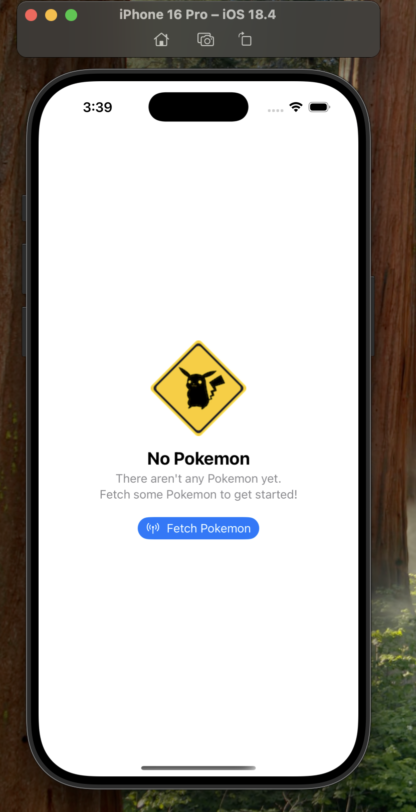
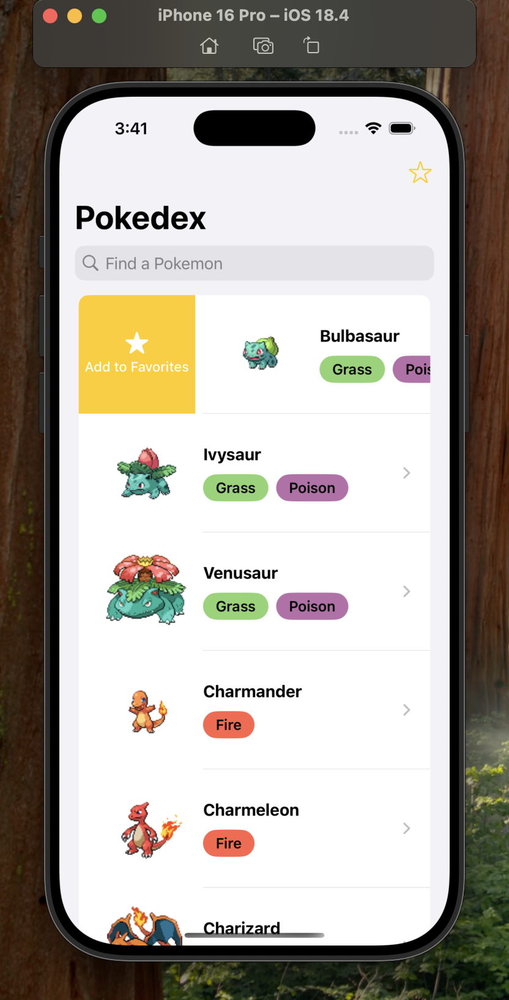
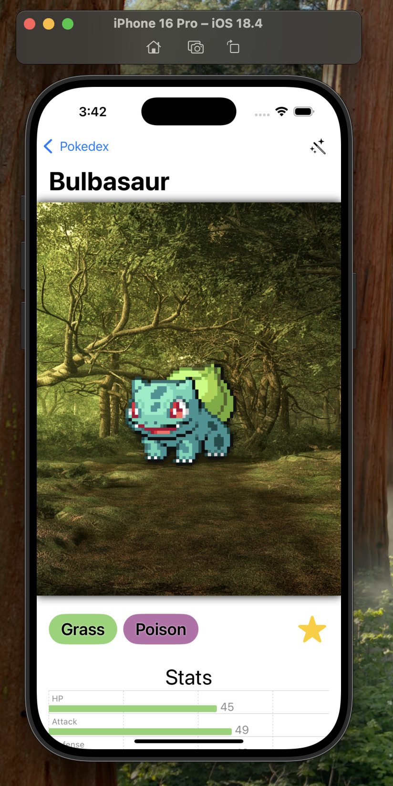
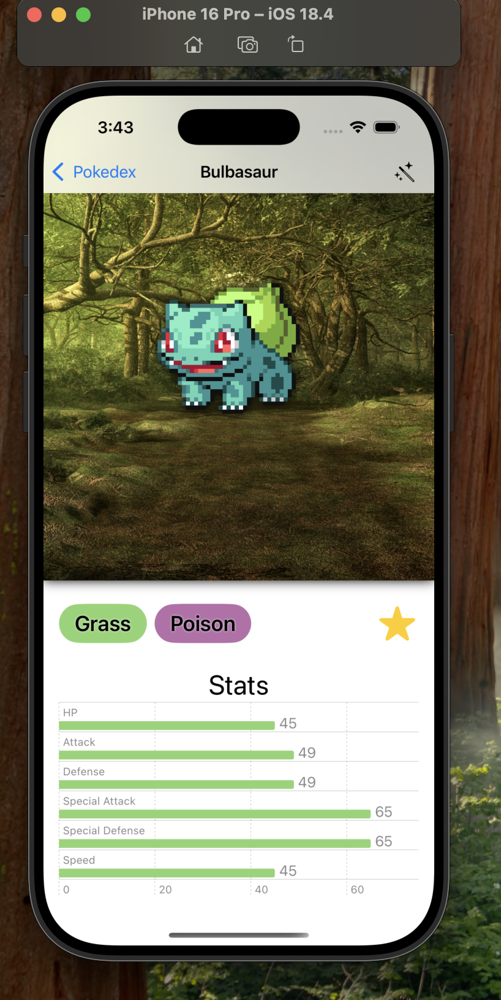
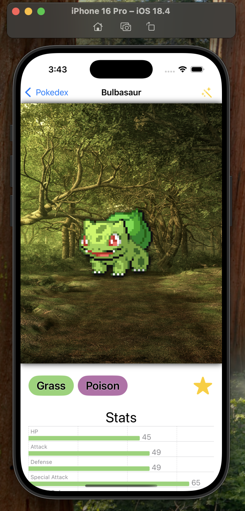
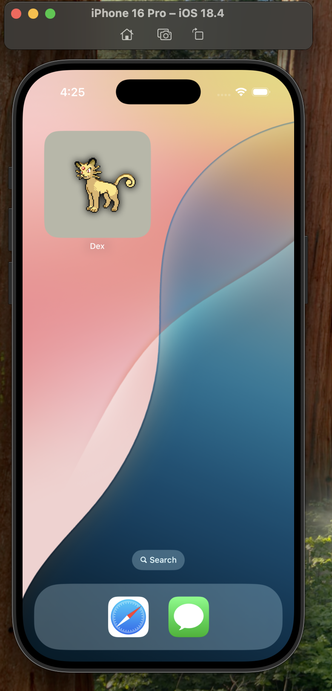
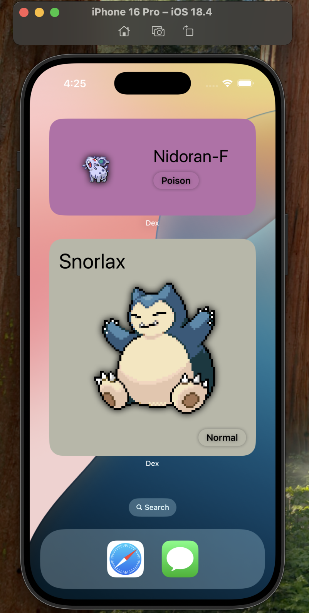

# 🦾 Dex - Pokedex App

**Dex** is a SwiftUI-powered Pokedex app that fetches Pokémon data from the PokéAPI and stores it locally using Core Data. The app leverages data persistence to minimize network requests and provide a smooth, offline-friendly experience.

---

## ✨ Features

- 📦 **Data Persistence:** Store Pokémon data using **Core Data** with binary data storage for sprites
- 🌐 **Networking:** Fetch Pokémon data from the **PokéAPI** using async/await
- 🧵 **Concurrency:** Handle data fetching and saving with structured concurrency
- 🔍 **Filtering and Search:** Search by Pokémon name and filter by favorites
- 📊 **Swift Charts:** Visualize Pokémon stats using customizable bar charts
- 🗑️ **Swipe Actions:** Implement swipe-to-favorite functionality in Pokémon list
- 🛠 **Data Transformation:** Transform JSON data into Core Data entities
- 🛡️ **Error Handling:** Safely handle data fetching and storage errors
- 📱 Fully SwiftUI-native with dark mode optimization

---

## 🛠 Technologies Used

- **Swift 6**
- **SwiftUI**
- **Core Data / SwiftData**
- **Combine** (for data binding and state management)
- **URLSession** for networking
- **Async/Await** for concurrency
- **Swift Charts** for visualizing Pokémon stats
- **FetchRequest & NSPredicate** for dynamic querying
- **ContentUnavailableView** for empty states
- **App Group** for shared data storage

---

## 🧭 How to Run

1. Clone the repository:
   ```bash
   git clone https://github.com/Collin-Schmitt/Dex.git
2. Open the project in Xcode 15 or later
3. Make sure you are connected to internet (just for the initial data fetching)
4. Run the app on an IOS 17+ simulator/device

---

## 📸 Screenshots

<h4>Initial Home Screen</h4>


<h4>Home Screen with Swipe Action to Favorite Pokémon</h4>


<h4>Favorites Screen</h4>


<h4>Pokemon Detail Screen</h4>


<h4>Pokemon Detail Screen - Part 2</h4>


<h4>Shiny Pokemon Image Toggle</h4>


<h4>Widget - Small Size</h4>


<h4>Widget - Medium & Large Sizes</h4>

